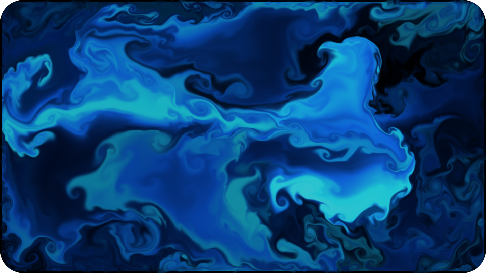

# 🌊 2D fluid simulation

 

This program approximates the solutions of the Navier-Stokes equations to simulate the behavior of a fluid in 2D. It can be shaken with the mouse in real time.

 

⚠️ This repository contains **submodules**, add `--recurse-submodules` when cloning ⚠️

 

	

 

# 📋 Summary

* **[📋 Summary](#-summary)**
* **[✨ Features](#-features)**
* **[🛠️ Install](#%EF%B8%8F-install)**
	* [🦴 Skeleton project install](#-skeleton-project-install)
* **[🗓️ Releases](#%EF%B8%8F-releases)**
* **[🧪 Tests](#-tests)**
* **[🙏 Credits](#-credits)**

 

# ✨ Features

* A menu to control the simulation

* Different layers to display *(dye, velocity, pressure...)*

* You can choose the resolution of the grid

* You can change the strength of the vorticity confinement and the mouse forces

* You can choose the number of iterations for the solver

 

# 🛠️ Install

## 🦴 Skeleton project install

This repository is based on my [**Graphics skeleton project**](https://github.com/angeluriot/Graphics_skeleton), so go see its [**install**](https://github.com/angeluriot/Graphics_skeleton#install) part.

 

# 🗓️ Releases

If you just want to test the program without editing the source code, go see the [**Releases**](https://github.com/angeluriot/2D_fluid_simulation/releases).

 

# 🧪 Tests

	

	

	

 

# 🙏 Credits

* [**Angel Uriot**](https://github.com/angeluriot) : Creator of the project.
